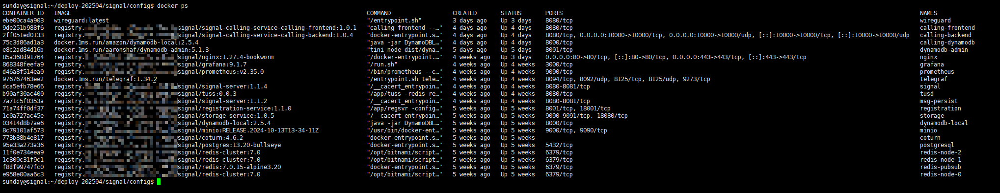

# deploy-signal-server
deploy all signal server components on your own servers.

Due to the high security of the Signal protocol, I believe some people might be interested in running Signal on their own servers. On my end, I have successfully deployed a complete Signal server on my own server (around late April 2025), including the storage service (modified implementation), tusd (reimplemented), registration (reimplemented), coturn && SFU, as well as three clients: Android, Desktop, and iOS. If anyone is interested, I can provide technical support.

You can contact me at wechat: pfoxh25 

Currently, deploying a complete Signal server requires running at least the following components:
- [signal-server](https://github.com/signalapp/Signal-Server)
- [storage service](https://github.com/signalapp/storage-service)
- [registration](https://github.com/signalapp/registration-service)
- [coturn](https://github.com/signalapp/coturn)
- [tusd storage](https://github.com/signalapp/tus-server)
- [signal-calling-service](https://github.com/signalapp/Signal-Calling-Service)
- [SVR2](https://github.com/signalapp/SecureValueRecovery2)
- [ContactDiscoveryService](https://github.com/signalapp/ContactDiscoveryService-Icelake)

middleware:
- S3/minio
- dynamodb
- redis
- telegraf/prometheus

clients:
- [Android](https://github.com/signalapp/Signal-Android)
- [iOS](https://github.com/signalapp/Signal-iOS)
- [Desktop](https://github.com/signalapp/Signal-Desktop)
- [signal-cli unoffical](https://github.com/AsamK/signal-cli/)
